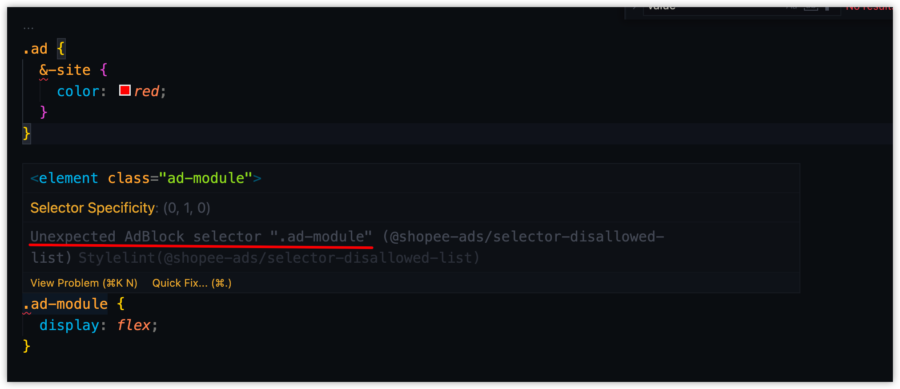
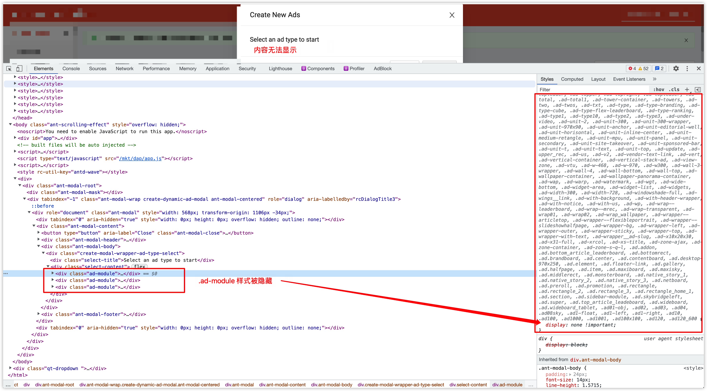

## 介绍

这是一份 stylelint 规则配置，用于检测 css 中是否存在 [ad block](https://www.getadblock.com/zh_CN/) 能够识别的[样式名称](https://easylist-downloads.adblockplus.org/easylistchina+easylist.txt)，当识别到对应样式时，会进行 error 提示，如下图所示：



## 背景

当浏览器安装 ad block 插件后，会向页面插入 style 样式，用于隐藏广告相关的样式名称。例如，当你在页面中使用了 `.ad-module`, `.ad-site` 等样式名称时，就会被 ad block 隐藏




## 安装

> npm i @shopee-ads/stylelint-config-adblock --save-dev

## 前置依赖

`stylelint >= 11.1.1`

## 配置

文件：`.stylelintrc.json`

```json
{
  "extends": ["@shopee-ads/stylelint-config-adblock"]
}
```

## QA

1. 使用 vscode 书写 css 样式时，如何获得编辑器的 lint 提示

   答：安装 `stylelint` 插件

2. 如何对项目进行一次全局校验

   答: `npx stylelint ./src/**/*.(css|less|scss|postcss)`
